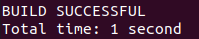

## VMware 설치

- mm에 올린 파일로 설치

## Ubuntu(20.04.6) 다운로드

- [다운로드 링크](https://releases.ubuntu.com/20.04.6/?_gl=1*xbg6p3*_gcl_au*NjgwMzQwNzg3LjE3MjQwNjUyMjM.&_ga=2.211611861.1138173725.1724065222-1980762445.1724065222)

## VMware에 Ubuntu 띄우기

- VMware 실행 후 ,Create a New Virtual Machine
    
    
    

- Ubuntu 이미지 삽입
    
    
    

- Full name에 ubuntu, User name에 hadoop, password는 자유, confirm에 비밀번호 다시 입력
    
    
    

- 이후 그냥 기본 설정대로 두고 모두 Next
- 이런거 저런거 할거냐고 뜨면 다 안함으로 넘기기
- Ubuntu 64 bit 클릭, 우분투 설치 진행 (자동), 설치 후 뜨는 창 모두 Next
- 터미널에 들어가서 hadoop@ubuntu:~$ 라고 되어있으면 성공

## Hadoop 설치 (터미널에서 실행)

- “hadoop@ubuntu:~$”   에서 아래 명령어 차례로 입력

- **wget http://kdd.snu.ac.kr/~kddlab/Project.tar.gz**

- **tar zxf Project.tar.gz**
    - ls 입력하여 파란글씨로 Project 있는지 확인
        
        
        

- **sudo chown -R hadoop:hadoop Project**
    - [여기](https://www.notion.so/1-c82de4aa1bdf40c787be5a3c1c76272a?pvs=21)(fullname, username, password)서 입력했던 비밀번호 입력

- **cd Project**
    - “hadoop@ubuntu:~$ “가 “hadoop@ubuntu:~/Project$ “로 변경

- **sudo mv hadoop-3.2.2 /usr/local/hadoop**

- **sudo apt update**

- **sudo apt install ssh openjdk-8-jdk ant -y**

- **./set_hadoop_env.sh**

- **source ~/.bashrc**

## Hadoop 실행 위한 준비

- 다시한 번 “hadoop@ubuntu:~/Project$ “인지 확인
    - “root@ubuntu : /home/hadoop# 이라면 Ctrl + d

- **ssh-keygen -t rsa -P “”**
    - 아무것도 누르지 말고 그냥 Enter

- **cat $HOME/.ssh/id_rsa.pub >> $HOME/.ssh/authorized_keys**

- **ssh localhost**
    - 질문이 뜨면 yes 입력
    - 비밀번호를 물어보지 않고 prompt가 뜨면 성공
    - 만약 Enter password to unlock the private key가 뜰 경우 취소 누르고 아래를 차례로 실행
        - rm $HOME/.ssh/id_rsa $HOME/.ssh/id_rsa.pub
        - ssh-keygen -t rsa -P "" -f $HOME/.ssh/id_rsa
        - cat $HOME/.ssh/id_rsa.pub >> $HOME/.ssh/authorized_keys
        - ssh localhost
        - 이러면 prompt 바로 뜸

- **hadoop namenode -format**

- **start-dfs.sh**

- **jps**
    
    
    

- **hdfs dfs -ls /**

- **hdfs dfs -mkdir /user**

- **hdfs dfs -mkdir /user/hadoop**
    - **hdfs dfs -ls /** 입력하여 아래와 같은지 확인
        
        
        
    - **hdfs dfs -ls /user** 입력하여 아래와 같은지 확인
        
        
        

## WordCount MapReduce 예제 코드 실행

- **cd ~/Project**
    - “hadoop@ubuntu:~/Project$ “인지 확인

- **ant**
    - **ls** 입력 후  빨간 글씨로 ssafy.jar 있는지 확인

- **hdfs dfs -mkdir wordcount_test**

- **hdfs dfs -rm -r wordcount_test_out** 입력 후 확인
    
    
    

- **hdfs dfs -put data/wordcount-data.txt wordcount_test**

- **hadoop jar ssafy.jar wordcount wordcount_test wordcount_test_out**

- **hdfs dfs -cat wordcount_test_out/part-r-00000 | more**
    
    
    

- **hdfs dfs -cat wordcount_test_out/part-r-00001 | more**
    
    
    

## **프로젝트 #1 - 각 단어의 첫 글자(알파벳)만을 카운트하는 프로그램 작성**

- pwd
    - /home/hadoop/Project 확인

- cd src
    - “hadoop@ubuntu:~/Project/src$ “ 확인

- **cp Wordcount.java Wordcount1char.java**
    - ls로 생성 확인
        
        
        

- **vi Wordcount1char.java**

- esc 한 번 누르고 :set number 입력 후 엔터
    - 행 번호 출력
        
        
        
    - 방향키로 이동하여 작성할 위치에 커서를 놓고 i를 눌러
        1. 17번째 행의 Wordcount를 Wordcouint1char로 수정
        2. 36번째 행의 itr.hasMoreTokens()뒤에.substring(0, 1) 추가
        3. 78번째 행의 Wordcount를 Wordcount1char로 수정
        - 중간에 잘못 입력했다면 esc 누르고 x로 하나씩 지울것(backspace 안됨)
            
            
            
            
            

- esc 누르고 :wq 입력

- **vi Driver.java**

- :set number로 행 출력, 8번째 행을 pgd.addClass("wordcount1char", Wordcount1char.class, "A map/reduce program that counts the 1st character of words in the input files.")로 수정 (기존 pgd 안 지우시고 그냥 추가하셔도 됩니다.)
    
    
    

- esc 누르고 :wq 입력

- **cd ..**
    - “hadoop@ubuntu:~/Project$ “ 확인
- 
- **ant**
    
    
    

- **hdfs dfs -rm -r wordcount_test_out**

- **hadoop jar ssafy.jar wordcount1char wordcount_test wordcount_test_out**

- **hdfs dfs -cat wordcount_test_out/part-r-00000 | more**\
    
    
    

- **hdfs dfs -cat wordcount_test_out/part-r-00000 | more**
    
    


```java
//Driver.java
package ssafy;

import org.apache.hadoop.util.ProgramDriver;

public class Driver {
	public static void main(String[] args) {
		int exitCode = -1;
		ProgramDriver pgd = new ProgramDriver();
		try {
			pgd.addClass("wordcount1char", Wordcount1char.class, "A map/reduce program that counts the 1st character of words in the input files.");

      			pgd.driver(args);
			exitCode = 0;
		}
		catch(Throwable e) {
			e.printStackTrace();
		}

		System.exit(exitCode);
	}
}
```

```java
//Wordcount1char.java
package ssafy;

import java.io.IOException;
import java.util.StringTokenizer;

import org.apache.hadoop.conf.Configuration;
import org.apache.hadoop.fs.Path;
import org.apache.hadoop.io.IntWritable;
import org.apache.hadoop.io.Text;
import org.apache.hadoop.mapreduce.Job;
import org.apache.hadoop.mapreduce.Mapper;
import org.apache.hadoop.mapreduce.Reducer;
import org.apache.hadoop.mapreduce.lib.input.FileInputFormat;
import org.apache.hadoop.mapreduce.lib.output.FileOutputFormat;
import org.apache.hadoop.util.GenericOptionsParser;

public class Wordcount1char {
	/* 
	Object, Text : input key-value pair type (always same (to get a line of input file))
	Text, IntWritable : output key-value pair type
	*/
	public static class TokenizerMapper
			extends Mapper<Object,Text,Text,IntWritable> {

		// variable declairations
		private final static IntWritable one = new IntWritable(1);
		private Text word = new Text();

		// map function (Context -> fixed parameter)
		public void map(Object key, Text value, Context context)
				throws IOException, InterruptedException {

			// value.toString() : get a line
			StringTokenizer itr = new StringTokenizer(value.toString());
			while ( itr.hasMoreTokens() ) {
				word.set(itr.nextToken().substring(0, 1));

				// emit a key-value pair
				context.write(word,one);
			}
		}
	}

	/*
	Text, IntWritable : input key type and the value type of input value list
	Text, IntWritable : output key-value pair type
	*/
	public static class IntSumReducer
			extends Reducer<Text,IntWritable,Text,IntWritable> {

		// variables
		private IntWritable result = new IntWritable();

		// key : a disticnt word
		// values :  Iterable type (data list)
		public void reduce(Text key, Iterable<IntWritable> values, Context context) 
				throws IOException, InterruptedException {

			int sum = 0;
			for ( IntWritable val : values ) {
				sum += val.get();
			}
			result.set(sum);
			context.write(key,result);
		}
	}


	/* Main function */
	public static void main(String[] args) throws Exception {
		Configuration conf = new Configuration();
		String[] otherArgs = new GenericOptionsParser(conf,args).getRemainingArgs();
		if ( otherArgs.length != 2 ) {
			System.err.println("Usage: <in> <out>");
			System.exit(2);
		}
		Job job = new Job(conf,"word count");
		job.setJarByClass(Wordcount1char.class);

		// let hadoop know my map and reduce classes
		job.setMapperClass(TokenizerMapper.class);
		job.setReducerClass(IntSumReducer.class);

		job.setOutputKeyClass(Text.class);
		job.setOutputValueClass(IntWritable.class);

		// set number of reduces
		job.setNumReduceTasks(2);

		// set input and output directories
		FileInputFormat.addInputPath(job,new Path(otherArgs[0]));
		FileOutputFormat.setOutputPath(job,new Path(otherArgs[1]));
		System.exit(job.waitForCompletion(true) ? 0 : 1 );
	}
}


```